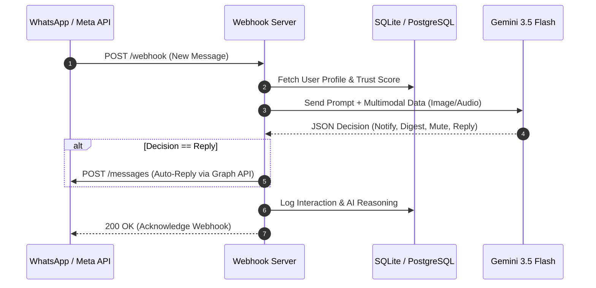

# 🚀 WhatsApp AI Notification Router (Enterprise Edition)

[](https://www.python.org/downloads/)
[](https://fastapi.tiangolo.com/)
[](https://deepmind.google/technologies/gemini/)
[](https://www.sqlalchemy.org/)
[](https://opensource.org/licenses/MIT)

An intelligent, AI-powered WhatsApp message bouncer and router. It acts as an **Enterprise Firewall for your attention**, using **Google Gemini** to automatically filter, digest, and autonomously reply to incoming WhatsApp messages based on context, multimodal analysis, and user trust scores.

---

## ✨ Enterprise Features

* **🛡️ AI Bouncer & Firewall:** Stops notification fatigue by actively judging if a message is worth your immediate attention, or if it should be muted/batched into a digest.
* **🤖 Two-Way Agentic Replies:** When a sender asks a direct question, the AI can choose the `reply` action and autonomously converse with them via the Meta Graph API while you sleep.
* **👁️ Multimodal Analysis:** Doesn't just read text—it analyzes images (flyers, memes) and listens to audio (voice notes) to determine priority.
* **🧠 Dynamic Trust Scoring:** Cross-references senders against a dynamic registry to auto-mute scammers and immediately pass through high-trust contacts (like family or VIP clients).
* **📊 Live Analytics Dashboard:** A real-time, polling HTML dashboard (`http://localhost:8000/`) that visualizes the AI's internal reasoning and routing history.
* **⚡ Async Architecture:** Built on FastAPI and asynchronous SQLAlchemy (SQLite/PostgreSQL) for high-concurrency webhook processing.

---

## 🏗️ System Architecture



---

## 🛠️ Installation & Setup

### 1. Install Dependencies
Ensure you have Python 3.11+ installed.
```bash
python -m venv .venv
source .venv/bin/activate
pip install -r requirements.txt
```

### 2. Configure Environment Variables
Copy the example environment file and fill in your API keys:
```bash
cp .env.example .env
```
You will need:
* `GEMINI_API_KEY`: Get this from [Google AI Studio](https://aistudio.google.com/).
* `META_VERIFY_TOKEN`: A secure random string you choose to verify your webhook.
* `META_ACCESS_TOKEN`: Your Permanent Page Access Token from the Meta App Dashboard.
* `META_PHONE_NUMBER_ID`: The Phone Number ID assigned to your real WhatsApp Business number.

### 3. Run the Server
Start the FastAPI server with auto-reload enabled:
```bash
uvicorn src.router.api:app --reload
```
The server will start on `http://127.0.0.1:8000`.

### 4. Connect to Meta (WhatsApp Cloud API)
1. Expose your local server securely using Ngrok: 
   ```bash
   ngrok http 8000
   ```
2. Go to your **Meta App Dashboard** > **WhatsApp** > **Configuration**.
3. Set your Callback URL to `https://<your-ngrok-url>.ngrok-free.dev/webhook`.
4. Enter your `META_VERIFY_TOKEN` and click **Verify and Save**.
5. Subscribe to the `messages` webhook field.
6. *(Important)* If you are using a physical phone to test, ensure your app is in **Live Mode**, or use a verified test number in **Development Mode** following Meta's 24-hour sandbox rules.

---

## 💻 The Dashboard
Navigate to `http://localhost:8000/` in your browser while the server is running to view the live analytics dashboard. You will see messages pop up in real-time as they are processed by the AI, completely with their routing tag (🔴 Notify, 🟡 Digest, ⚫ Mute, 🔵 Reply) and Gemini's internal reasoning.

---

## 📁 Project Structure

```text
whatsapp-notification-router/
├── .env.example                       # Environment variables template
├── requirements.txt                   # Project dependencies
├── pyproject.toml                     # Package configuration
├── src/
│   └── router/
│       ├── api.py                     # FastAPI server and webhook endpoints
│       ├── config.py                  # API settings, thresholds, safety lists
│       ├── database.py                # SQLAlchemy async engine setup
│       ├── db_models.py               # Database table schemas
│       ├── engine.py                  # Core routing logic & AI orchestration
│       ├── meta_api.py                # Outbound WhatsApp Graph API client
│       ├── prompt.py                  # Gemini prompt composition
│       ├── webhook.py                 # Meta webhook parsing logic
│       ├── dashboard.html             # UI for the live analytics dashboard
│       └── ... (schemas and utils)
└── tests/                             # Pytest async database & routing tests
```

---

## 🧪 Testing

Run the automated test suite to ensure the database and AI routing logic are functioning correctly:
```bash
pytest tests/
```

---

## 📄 License
Released under the [GNU General Public License v3.0](LICENSE). Designed for privacy-first, intelligent message routing.
